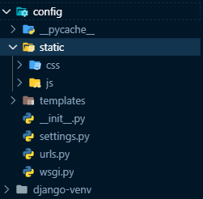

[TOC]

### 인스타클론 만들기

#### MTV


#### 세팅

- 가상환경 생성(미니컴퓨터 생성)

```bash
$ pyenv install 3.7.2
$ pyenv global 3.7.2
$ pyenv rehash
$ python -V
# === version 확인 후, 가상환경 원하는 폴더에서 ===
$ virtualenv venv
$ source venv/Script/activate
# === 그러면, 이렇게 될 것 ===
(venv) ~
$ pip3 list 
$ pip3 install django==2.1
# 장고의 맞춤 버전을 설치한다.
$ django-admin startproject config .
# .이라는 현재 폴더에 config를 설치한다.
# 설정 파일이 생성
# settings.py 변경
$ LANGUAGE_CODE = 'ko-kr'
$ TIME_ZONE = 'Asia/Seoul'
# db 생성
$ python manage.py migrate
$ python manage.py runserver

# 브라우저에서 127.0.0.1:8000 확인
# 가상환경 실행
$ source django-venv/Scripts/activate
# 가상환경 종료
$  deactivate
```

#### github

- venv 를 빼고 올리는게 좋다.

- 다시 이전 커밋으로 돌리고 싶을 때 사용하는 명령어

  ```bash
  git reset --hard
  ```

#### accounts: create,settings

```bash	
django-admin startapp accounts 	# 뭔가를 만드는 행위. accounts 폴더가 생겼다!
```

- config > settings.py 다루기

```python
# ['*'] or []
ALLOWED_HOSTS = ['*']
```

```python
# folder settings
INSTALLED_APPS = [
    'django.contrib.admin',
    'django.contrib.auth',
    'django.contrib.contenttypes',
    'django.contrib.sessions',
    'django.contrib.messages',
    'django.contrib.staticfiles',
    'accounts',		# <-
]
```

```python
TEMPLATES = [
    {
        'BACKEND': 'django.template.backends.django.DjangoTemplates',
        'DIRS': [
            # html settings
            os.path.join(BASE_DIR,'config','templates'),	# <- 폴더 생성해주자.
        ],
        'APP_DIRS': True,
        'OPTIONS': {
            'context_processors': [
                'django.template.context_processors.debug',
                'django.template.context_processors.request',
                'django.contrib.auth.context_processors.auth',
                'django.contrib.messages.context_processors.messages',
            ],
        },
    },
]
```

```python
# language settings
LANGUAGE_CODE = 'ko-kr'

TIME_ZONE = 'Asia/Seoul'
```

```python
# js , css , media files , login redirect settings
STATIC_URL = '/static/'
STATICFILES_DIRS=[
    os.path.join(BASE_DIR,'config','static'),
]
STATIC_ROOT = os.path.join(BASE_DIR,'staticfiles')

# Media files
MEDIA_URL = '/media/'
MEDIA_ROOT = os.path.join(BASE_DIR,'media')

LOGIN_REDIRECT_URL = '/'
```

- 최종 구조



#### accounts: model

```bash
# 이미지 처리를 위한 pip download
pip install pillow
pip install pilkit
pip install psycopg2-binary
pip install django-imagekit
$ service postgresql start	# postgresql 사용하고 싶다면?
```

- accounts > models.py 

  ```python
  from django.conf import settings
  from django.db import models
  from imagekit.models import ProcessedImageField
  from imagekit.processors import ResizeToFill
  
  def user_path(instance,filename):
      from random import choice
      import string
      arr = [choice(stirng.ascii_letters) for _ in range()]
      pid = ''.join(arr)
      extension = filename.split('.')[-1]
      return 'accounts/{}/{}.{}'.format(instance.user.username, pid, extension)
  
  
  # Create your models here.
  class Profile(models.Model):
      user = models.OneToOneField(settings.AUTH_USER_MODEL, on_delete=models.CASCADE)
      nickname = models.CharField('별명', max_length=20, unique=True)
      picture = ProcessedImageField(upload_to=user_path,
                                      processors=[ResizeToFill(150,150)],
                                      format="JPEG",
                                      options={'quality:90'},
                                      blank=True,
                                      )
      about = models.CharField(max_length=300, blank=True)
      GENDER_C = (
          ('선택안함','선택안함'),
          ('여성','여성'),
          ('남성','남성'),
      )
      gender = models.CharField('성별(선택사항)',
                                  max_length=10,
                                  choices=GENDER_C,
                                  default='N')
  
      def __str__(self):
          return self.nickname
  ```

- 다 처리 후

  ```bash
  python manage.py makemigrations accounts
  python manage.py migrate
  ```


#### accounts:admin

- accounts - admin.py

```python
from django.contrib import admin
from .models import Profile

# Register your models here.

@admin.register(Profile)
class ProfileAdmin(admin.ModelAdmin):
    list_display = ['id','nickname','user']
    list_display_links = ['nickname','user',]
    search_fields = ['nickname']
```

```python
python manage.py runserver # 실행하기
```

```python
python manage.py createsuperuser	# 슈퍼유저 생성하기
```

#### static: 프론트엔드 예제파일 업로드

- static 폴더 밑에 css, js, imgs 업로드 해준다

#### templates:layout

```html

<!DOCTYPE html>
<html lang="ko">
<head>
    <meta charset="UTF-8">
    <meta name="viewport" content="width=device-width, initial-scale=1.0">
    <meta http-equiv="X-UA-Compatible" content="ie=edge">
    <title>Document</title>
    <link rel="stylesheet" href="">
    <link rel="stylesheet" href="">
    <link rel="stylesheet" href="">
    <link rel="stylesheet" href="">
    <link rel="stylesheet" href="">
    <link rel="stylesheet" href="">
    <link rel="stylesheet" href="">

    <link rel="stylesheet" href="">
</head>
<body>
    <section id="container">
        <header id="header">
            <section id="h_inner">
                <h1 class="logo">
                    <div class="sprite_insta_icon"></div>
                    <div>
                        <div class="sprite_write_logo"></div>
                    </div>
                </h1>
                <div class="search_field">
                    <input type="text" placeholder="검색" tabindex="0">
                    <div class="fake_field">
                        <span class="sprite_small_search_icon"></span>
                        <span>검색</span>
                    </div>
                </div>
                <div class="right_icons">
                    <div class="sprite_camera_icon"><a href="#"></a></div>
                    <div class="sprite_compass_icon"><a href="#"></a></div>
                    <div class="sprite_heart_icon_outline"><a href="#"></a></div>
                    <div class="sprite_user_icon_outline"><a href="#"></a></div>
                </div>
            </section>
        </header>

        
        
    </section>
</body>
</html>
```

#### 회원가입|로그인|로그아웃 :: views

```bash
pip3 install django-allauth
```

- settings.py 수정

  ```python
  # folder settings
  INSTALLED_APPS = [
      'django.contrib.admin',
      'django.contrib.auth',
      'django.contrib.contenttypes',
      'django.contrib.sessions',
      'django.contrib.messages',
      'django.contrib.staticfiles',
  	# 이부분 수정
      'django.contrib.sites',
      'allauth',
      'allauth.account',
  
      'accounts',
  ]
  ```

- accounts - urls.py 수정

  ```python
  from django.urls import path
  from .views import *
  
  app_name = 'accounts'
  
  url_patterns = [
      path('signup/',signup,name='signup'),
      path('login/',login_check,name='login'),
      path('logout/',logout,name='logout'),
  ]
  ```

### 회원가입|로그인|로그아웃 :: forms

- accounts - views.py 작성

  ```python
  from django.contrib.auth import authenticate, login
  from django.shortcuts import redirect, render
  from django.contrib.auth import logout as django_logout
  from .forms import SignupForm, LoginForm
  
  def signup(request):
      if request.method == 'POST':
          form = SignupForm(request.POST, request.FILES)
          if form.is_valid():
              user = form.save() # 저장하기
              return redirect('accounts:login')
          else:
              form = SignupForm()
          return render(request, 'accounts/signup.html', {
              'form':form,
          })
          
  def login_check(request):
      if request.method == "POST":
          form = LoginForm(request.POST)
          name = request.POST.get("username")
          pwd = request.POST.get('password')
          
          user = authentiacate(username=name,password=pwd)
          
          if user is not None:
              login(request,user)
              return redirect("/")
          else:
              return render(request,'accounts/login_fail_info.html')
      else:
          form = LoginForm()
          return render(request,'accounts/login.html',{
              "form":form
          })
  
  def logout(request):
      django_logout(request)
      return redirect("/")
              
  ```

- accounts - forms.py 작성

  ```python
  from django import forms
  from django.contrib.auth.forms import UserCreationForm
  
  class LoginForm(forms.ModelForm):
      
  class SignupForm(UserCreationForm):
  ```

  

